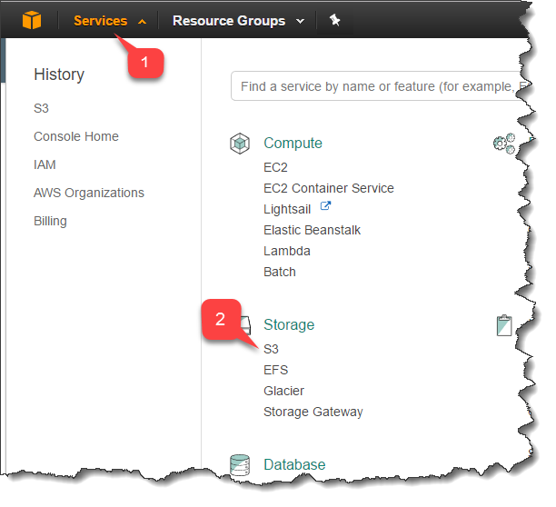
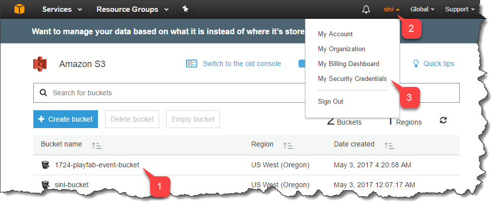
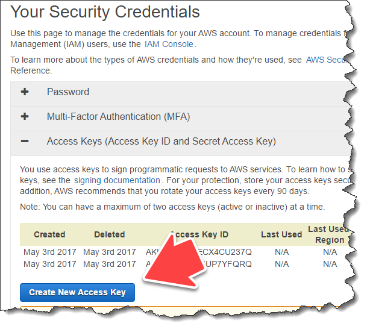
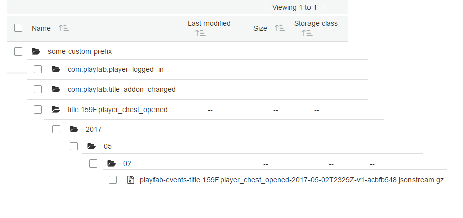

# S3 Event Archiving

PlayFab allows you to archive the entire event flow using Amazon S3 Bucket. This tutorial shows you step-by-step how to configure event archiving from scratch. Each step is represented as a picture followed by a description.

## Configuring Amazon S3 Bucket

  

Once you have created an Amazon account, navigate to "Services" **(1)** and select "S3" **(2)**.

  

On the S3 page, you will have an overview of all your buckets and you will notice a button for creating a new bucket. Click it.

  

To create your new S3 bucket, you must go though a 4-step wizard. Step 1 requires you to assign a unique, DNS-compliant name for your bucket **(1)**. Make sure to have that name available somewhere for copying and pasting. We will need it when we configure PlayFab event archiving. When you are done, hit "Next" **(2)**.

  

Step 2 offers you to **optionally** add versioning, logging, and tagging for your bucket. Click "Next" **(1)**.

  

During Step 3, ensure that you have Read/Write access **(1)** for objects. Hit "Next" **(2)**.  

  

During Step 4, double check your settings and click "Create Bucket" **(1)**.

## Configuring Amazon Access

In order to archive events, you will need to give PlayFab access to the bucket on your behalf. This is done by means of an Access Key.

  

Double check that you have your newly created bucket in the list of S3 services **(1)**. Then click your account name in the top right corner **(2)** and select "My Security Credentials" **(3)**.

  

Locate the access key list and the "Create New Access Key" button. Click it.

  

Expand the Access Key data **(1)**. Save the Access Key ID **(2)** and Secret Access Key **(3)**. Make sure they are available for copy/paste. We will need them when we configure PlayFab event archiving. Hit "Close" **(4)**.

## Configuring PlayFab Event Archiving

When your Amazon S3 bucket is ready, it's time to set up the PlayFab side of things. We need to pass the access key data and bucket name to PlayFab to enable event archiving.

  

To access the PlayFab Event Archive, select "Analytics" in the sidebar panel **(1)**. Then select the "Event Archive" tab **(2)**. Finally, click the "Update Settings" button **(3)**.

The Update Settings page will offer you the following settings:

1. Amazon S3 **bucket name** (use the one you created while configuring the Amazon S3 Bucket).
2. Prefix is the **root folder** under which PlayFab will store all the relevant data.
3. **Access Key ID** (use the one you obtained while configuring access to the Amazon Account).
4. **Secret Key** (use the one you obtained while configuring access to the Amazon Account).
5. Click "**Save Settings**" when everything is in place.

  

PlayFab should present you with a nice page indicating that Event Archiving is enabled.

  

Make sure to post some events and then check your bucket on the Amazon portal. Soon enough, you will see that new compressed JSON streams will appear, nicely split by title, event name, year, month and day.
