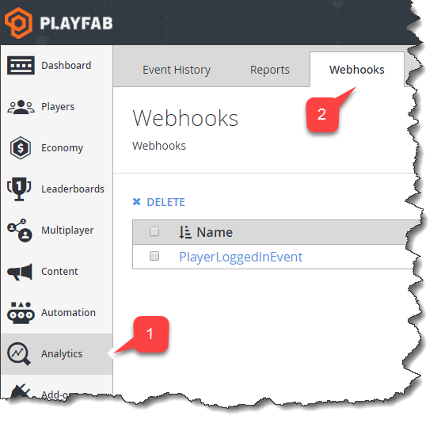
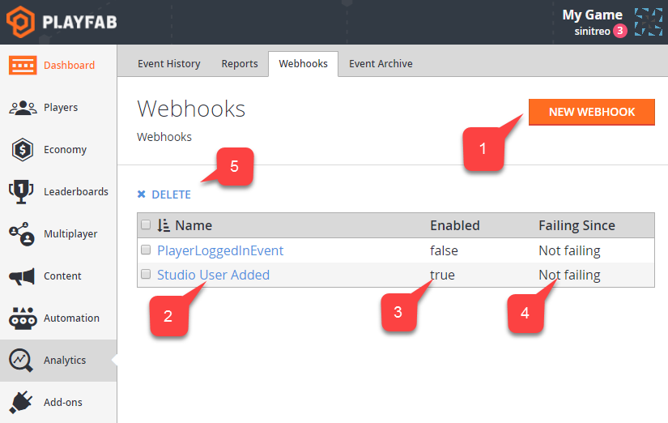

# Webhooks

In complex systems you may want to provide additional event handling on your custom server. PlayFab offers Webhooks to achieve this. Whenever a new event is emitted, it can be forwarded to your server by making a POST request to your custom web endpoint, and the event data is passed as the JSON body of the request.

## Accessing Webhooks

To access the Webhooks panel in the PlayFab Game Manager, select "Analytics" **(1)** in the sidebar menu. Then select the "Webhooks" tab **(2)**.

  

## Overview of the Webhooks panel

The following image provides an overview of the Webhooks panel:

  

1. The "New Webhook" button allows you to **create and configure a new Webhook**.
2. The **Webhook name** label, can be clicked to access and configure the Webhook.
3. The Status label, shows whether a **Webhook is** currently **enabled**.
4. The Failing Since label, shows when a **webhook endpoint stopped** returning OK responses.
5. When one or more Webhooks are selected, you can use the "Delete" button to **permanently remove** them.

## Configuring a Webhook

The following image describes the options for configuring a Webhook:

  

1. Select a **Webhook name** that will uniquely identify the Webhook.
2. Set up the **Endpoint URI**. This URI will be hit when the event occurs.
3. You may set the Webhook to be enabled or disabled. This allows you to temporarily suspend a Webhook without completely removing (deleting) it from the system.
4. Set up the **filters** to only process the events you need. You can filter by Event Name, Event Source, and PlayerID. You can have several filters per group, but each filter setting must be matched for the event to fall into the filter group.
5. You may define several **filter groups** to include different filters. Events must fall into at least one group to be passed to the Webhook.
