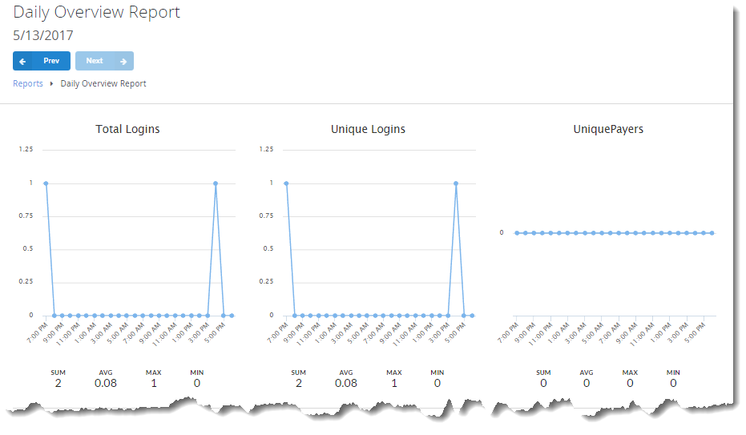
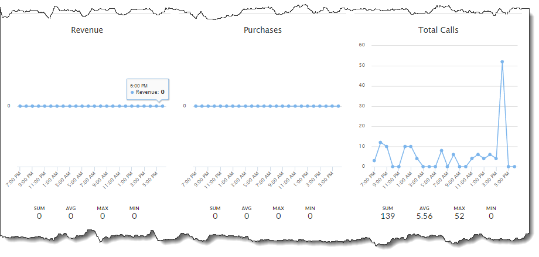
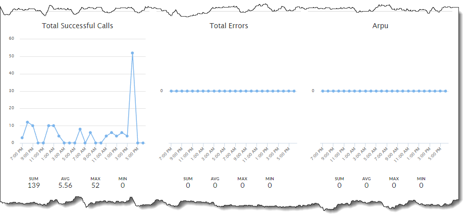
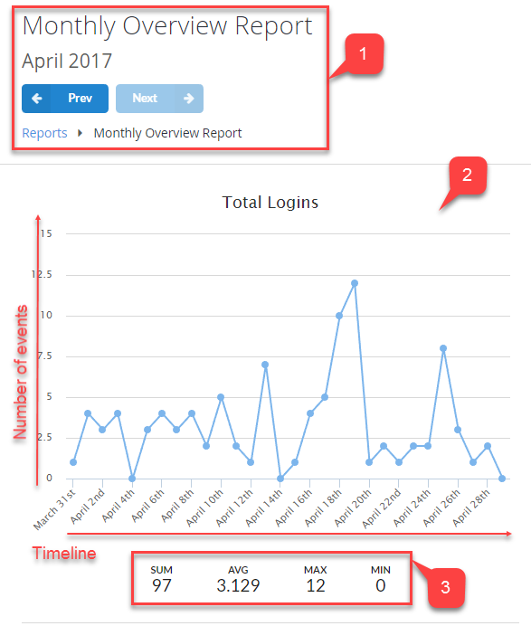

# Daily, Monthly, and Rolling 30-Day Overview and Totals Reports

## Introduction

**PlayFab** offers a set of **Daily** and **Monthly Key Performance Indicator** (**KPI**) **Reports**, including:

- **Total Logins**
- **Unique Logins**: **DAU** (**Daily Reports**) or **MAU** (**Monthly** and **Rolling 30-day Reports**)
- **New Users**
- **Unique Paying Users**
- **Transaction Revenue**
- **Purchases**
- **Total API Calls**
- **Total Successful API Calls**
- **Total API Call Errors**
- **Average Revenue Per User** (**ARPU**)
- **Average Revenue Per Paying User** (**ARPPU**)
- **Average Purchase Price**

An **Overview Report** contains trend charts of each metric during the past 24 hours (**Daily**), past 30 days (**Rolling 30-day**), and in last month (**Monthly**).

A **Totals Report** contains the summary of each metric shown in the **Overview Report**. **Daily** and **Rolling 30-day Reports** are generated on a daily basis, whereas **Monthly Reports** are generated on the first day of each month.

**Report** times are based on **Coordinated Universal Time** (**UTC**). For additional details on metrics, see [Metrics and Terminology](../metrics/metrics-and-terminology.md).

## Totals Reports

**Totals Reports** include a table which contains the **12 Key Performance Metrics** described in the introduction.

  

## Overview Reports

**Overview Reports** consist of **12 Trend Charts** - one for each metric described in the introduction. Working with **Charts** is described later in this tutorial.

  

  

  

  

## Populating the Reports

Any **API** call may introduce new data for **Total API Calls**, **Total Successful API Calls** and **Total API Call Errors**.

- Once executed, an **API** call will be added to **Total API Calls**.
- If there is an **Error** that is introduced, it will be recorded to **Total API Call Errors**.
- If *no* **Error** is introduced, it will belong to **Total Successful API Calls**.

Please consult our [PlayFab API Reference documentation](../../../api-references/index.md) to review all available **API** calls.

The following **API** calls will introduce new data for **Total Logins** and **Total Unique Logins**:

- [LoginWithAndroidDeviceID](xref:titleid.playfabapi.com.client.authentication.loginwithandroiddeviceid)
- [LoginWithCustomID](xref:titleid.playfabapi.com.client.authentication.loginwithcustomid)
- [LoginWithEmailAddress](xref:titleid.playfabapi.com.client.authentication.loginwithemailaddress)
- [LoginWithFacebook](xref:titleid.playfabapi.com.client.authentication.loginwithfacebook)
- [LoginWithGameCenter](xref:titleid.playfabapi.com.client.authentication.loginwithgamecenter)
- [LoginWithGoogleAccount](xref:titleid.playfabapi.com.client.authentication.loginwithgoogleaccount)
- [LoginWithIOSDeviceID](xref:titleid.playfabapi.com.client.authentication.loginwithiosdeviceid)
- [LoginWithKongregate](xref:titleid.playfabapi.com.client.authentication.loginwithkongregate)
- [LoginWithPlayFab](xref:titleid.playfabapi.com.client.authentication.loginwithplayfab)
- [LoginWithSteam](xref:titleid.playfabapi.com.client.authentication.loginwithsteam)
- [LoginWithTwitch](xref:titleid.playfabapi.com.client.authentication.loginwithtwitch)
- [LoginWithWindowsHello](xref:titleid.playfabapi.com.client.authentication.loginwithwindowshello)

The following **API** calls will introduce new data for **Total New Users**:

- [RegisterPlayFabUser](xref:titleid.playfabapi.com.client.authentication.registerplayfabuser)
- [RegisterWithWindowsHello](xref:titleid.playfabapi.com.client.authentication.registerwithwindowshello)

The following **API** calls will introduce new data for **Total New Users** if the **CreateAccount** flag is set:

- [LoginWithAndroidDeviceID](xref:titleid.playfabapi.com.client.authentication.loginwithandroiddeviceid)
- [LoginWithCustomID](xref:titleid.playfabapi.com.client.authentication.loginwithcustomid)
- [LoginWithFacebook](xref:titleid.playfabapi.com.client.authentication.loginwithfacebook)
- [LoginWithGameCenter](xref:titleid.playfabapi.com.client.authentication.loginwithgamecenter)
- [LoginWithGoogleAccount](xref:titleid.playfabapi.com.client.authentication.loginwithgoogleaccount)
- [LoginWithIOSDeviceID](xref:titleid.playfabapi.com.client.authentication.loginwithiosdeviceid)
- [LoginWithKongregate](xref:titleid.playfabapi.com.client.authentication.loginwithkongregate)
- [LoginWithSteam](xref:titleid.playfabapi.com.client.authentication.loginwithsteam)
- [LoginWithTwitch](xref:titleid.playfabapi.com.client.authentication.loginwithtwitch)

The **Unique Paying Users**, **Revenue**, **Purchases**, **Average Revenue Per User (ARPU)**, **Average Revenue Per Paying User (ARPPU)** and **Average Purchase Price** metrics are used to analyze purchases and payments.

See the [Non-receipt Payment Processing](../../commerce/economy/non-receipt-payment-processing.md) tutorial for more information on conducting payments.

## How to work with Report Charts

**PlayFab Report Charts** all follow the same model:

-  In the top space of the page, you usually get a **Control Panel (1)**. The **Control Panel** contains a **Report Name**, an observed time period, and **Prev/Next** buttons to switch between the time periods.

- **Chart** panel **(2)** (**Total Login**s) shows the available data as a **Chart**, where the horizontal axis corresponds to the time flow, and the vertical axis corresponds to the number of relevant instances - such as **API** calls, **Purchases**, **Users**, and so on, depending on the **Report** type.

  

- There are some metrics available below the **Chart** panel **(3)** in the **Timeline** area. This contains *totals* of all the instances across the time period (**SUM**), the *average number* of instances through all the timestamps (**AVG**), the *peak valu*e (**MAX**), and the *lowest value* (**MIN**).
